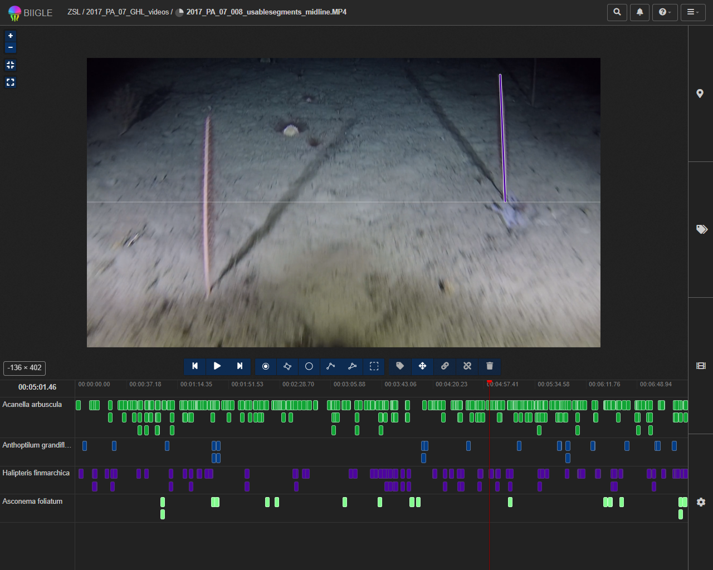

# TowedCameraTools
A variety of tools for working with benthic imagery from towed camera surveys

## Installation

You can install the development version of TowedCameraTools from [GitHub](https://github.com/) with:

``` r
# install.packages("devtools")
devtools::install_github("cyesson/TowedCameraTools")
```

## Examples

Load the library
``` r
library("TowedCameraTools")
```

Calculate area seen in an image from a downwardly angled camera (need to know height and angle of camera and its field of view (in water). Example is from [Long et al (2020)](https://doi.org/10.3389/fmars.2020.00460)
``` r
IA<-ImmageArea(Height=0.55, Angle=28.8, VFOV=40.3, HFOV=66.4)
```

Estimate in-water field of view from in-air field of view (refractive index of water varies by salinity - a good estimate for seawater is 1.34 and freshwater is 1.33)
``` r
FOV.water <- InWaterFOV(100, RefractiveIndex=1.34)
```

Create stills from a video at regular intervals, choosing most in-focus still at each interval time period.
``` r
log<-FixedIntervalStills("myvideo.mp4", window=0.5, interval=30)
```

Estimate towed camera position from ships position using the layback method
``` r
Layback.Position<-Layback(StartLong=0, StartLat=0, EndLong=1, EndLat=1, Depth=100, WireLength=120)
```

Estimate height of annotations for an image (need to know height and angle of camera, as well as its field of view). 
``` r
# Camera setup based on GoPro Hero 5 using medium FOV (setup as in Long et al 2020)
myCamSetup <- CamSetup(FullHFOV=122.6, FullVFOV=94.4, UsedHFOV=94.4, UsedVFOV=55, 
	PixDimX=2704, PixDimY=1520, FullSensorWidth=6.17, FullSensorHeight=4.65, 
	CamAngle=28.8, CamHeight=550)
# Calculate height of annotation in image
Annotation.Height<-AnnotationHeight(X1=1562, Y1=535, X2=1543, Y2=62, CamSetup=myCamSetup)
```

Above example is based on the image below - an annotation of a deep-sea seapen from Greenland. The height is calculated at ~315 mm.


Estimate width of image from laser point annotations.
``` r
# requires pixel coordinates of two horizontal, parallel lasers in image (e.g. biigle annotations)
ImageWidthFromLasers(LaserXY1=c(400, 900), LaserXY2=c(700, 900), LaserDistanceM=0.2, PixelDimensions=c(2000, 1000))

```

Validate trigonometric calcuations based on laser points. Calculates image width at height of lasers and compares with trigonometric calculations.
``` r
# requires details for functions ImageWidthFromLasers and ImageArea
ValidateWithLasers(LaserXY1=c(400, 900), LaserXY2=c(700, 900), LaserDistanceM=0.2, PixelDimensions=c(2000, 1000), 
                   Height=0.55, Angle=28.8, VFOV=40.3, HFOV=66.4)
```
